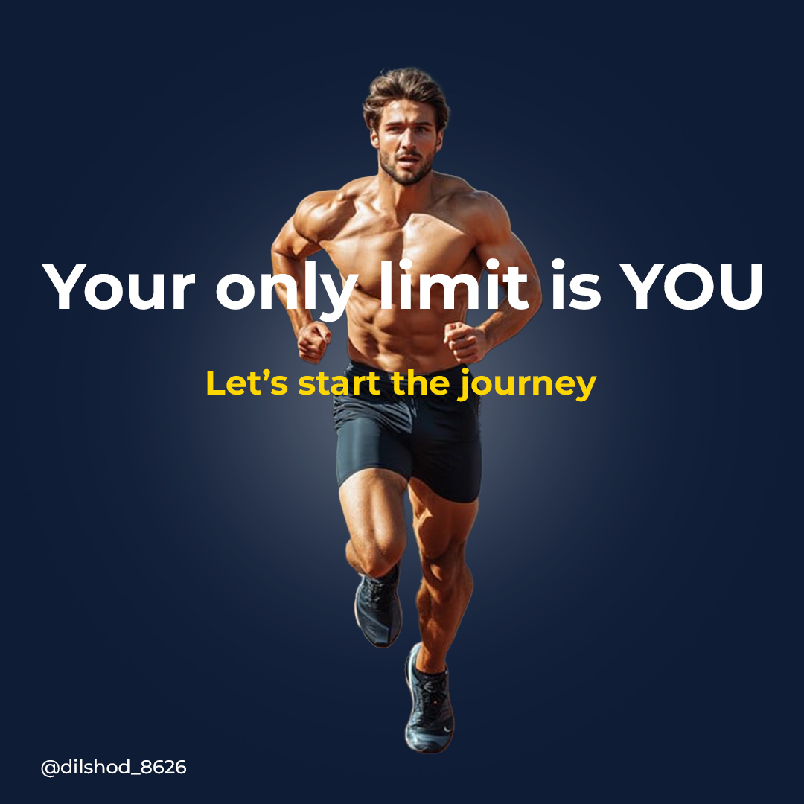

# Visual Design Portfolio | Dilshod U.

---

## 1. SMM Post Design (Motivational Fitness)

Created a highly engaging Instagram post (1080x1080 px) using strong contrast and motivational typography for a fitness brand. Optimized for screen viewing (RGB color).

 

---

## 2. Print Design: Business Consulting Flyer

Designed a print-ready, high-resolution (CMYK) A4 flyer to promote freelance consulting services. Focused on clear visual hierarchy and strong CTAs.

 

---

## 3. E-commerce Product Photo Retouching

Performed background removal and color correction for e-commerce listing images. Delivered final outputs in 1200x1200 px JPEG format.

# my-graphic-design-portfolio
A collection of my professional graphic design work.
